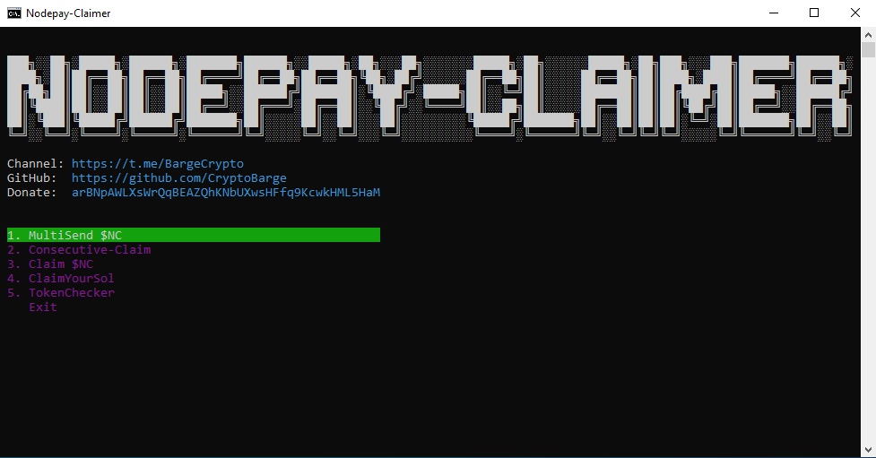

# 🧲 Nodepay-Claimer

<div>
<p align="center">
  
  
  <p align="center">
    <a href="https://t.me/BargeCrypto"></a>
    <a href="https://t.me/+nbpTp74UTnVmMmM6"></a>
</div>

## 🔎 Navigation

- [Requirements](#-requirements)
- [Installation](#-installation)
- [Configuration](#%EF%B8%8F-configuration)
- [Usage](#-usage)

## 📑 Requirements

- Node.js

## 📥 Installation

1. **Clone the Repository**
   ```bash
   git clone https://github.com/CryptoBarge/Nodepay-Claimer.git
   ```
2. **Install Dependencies**
   ```bash
   npm install
   ```

## ⚙️ Configuration

### 📁 config.json

```json5
  "THREADS": 3,
  "USE_PROXY": false,
  "RPC_ENDPOINT": "",       // If empty solana rpc will be used: https://api.mainnet-beta.solana.com;
  "VAULT_WALLET": "",       // Main wallet address PUBLIC KEY; Recommended to have Nodecoin($NC) on this wallet;
  "MASTER_WALLET": "",      // PRIVATE KEY; There should be a solana on this wallet. (~0.000005 SOL for one wallet from wallet.txt);
  "TIP_AMOUNT": 0.1,        // 0.1 = 10%, if >0.05 = 0.05(5%);
  "MIN_TOKEN_AMOUNT": 20    // Filters wallets by token balance;
```

### 📁 Input Files Structure

#### data/wallets.txt
```
2CQYCy8Jwer8t8ZPwhKDAhL17CNQWHojoLJGWE6Yj6uk5Po4xHcoW8XRnQzZjTsh3UNFq2UnRtQyxZx4UKXr92CJ
4QEYkSecKJgbiLyoNkLbufaXCyJz8AEGa26BqQpAepypCXucafgP1NoYSRKWWcmN1LfsFJLU1sod3RQsPmiorcWB
2jnkMifvFN5mrK5T8kmRdUQAZdVxWp4irLMNzUH29Ye5dQQ7qfKGfwMm6HQr87yNSP5twb8CV1NPCZS8zeRT5EHi
```

#### data/proxies.txt
```
http://user:pass@ip:port
http://ip:port:user:pass
socks5://user:pass@ip:port
```

## ⚠️ Important Notes

- 💸 **MultiSend $NC** - Sends tokens $NC from wallets.txt to VAULT_WALLET.
- 💰 **Consecutive-claim** - Claims tokens from wallets.txt, sends them to the VAULT_WALLET address, closes the Associated Token Account, and transfers all remaining $SOL to the next wallet. <br><br>**NOTE**: The first wallet in wallets.txt must have enough SOL to cover all imported wallets. The cost of claiming tokens for one wallet is 🔥**0.0027898 SOL**🔥, but the wallet balance should not be less than ~0.05 SOL. Plan ahead so that the second-to-last wallet has at least ~0.025 SOL remaining. For convenience, set your **main wallet** as the last one.
<br><br>**RECOMMENDED**: Before starting to use the mode, send **1 Nodecoin($NC)** to the address that you plan to specify as VAULT_WALLET. <br>If the wallet specified in VAULT_WALLET does not have Nodecoin, an additional **-0.00203928 SOL** will be debited for opening ATA for this wallet.

- 🧲 **Claim $NC** - Claims all available tokens for a wallet.
- 💲 **ClaimYourSol** - Closes the Associated Token Account on wallets from **wallets.txt**. There are several possible scenarios: <br><br>1️⃣ If all wallets have a **0 SOL balance**, you need to enter the private key of a wallet with SOL into the **MASTER_WALLET** field in **config.json**. In this case, **MASTER_WALLET** covers the transaction fee (~**0.000005 SOL**), and all SOL obtained from closing the accounts is sent to **VAULT_WALLET**. **VAULT_WALLET** can be either the same wallet as **MASTER_WALLET** or any other public key of your choice. <br><br>2️⃣If the wallets in **wallets.txt** have SOL but the **MASTER_WALLET** field is left empty, each wallet pays its own transaction fee. The SOL obtained from closing the accounts is sent to **VAULT_WALLET**. <br><br>**NOTE**: The tokens must be **absent** from the balance. In **VAULT_WALLET**, enter a public key. In **MASTER_WALLET**, enter a private key.
- 🧮 **TokenCheker** - Filters wallets from wallets.txt by MIN_TOKEN_AMOUNT tokens and writes the result to checked_wallets.txt

## 🚀 Usage

1. Configure all necessary files as described above
2. Start the claimer:
   ```bash
   node console.js
   ```

## 📞 Support

Join our Telegram community for support:
- 📢 Channel: [CryptoBarge](https://t.me/BargeCrypto)
- 💬 Chat:    [Chat$БАРЖА](https://t.me/+nbpTp74UTnVmMmM6)
